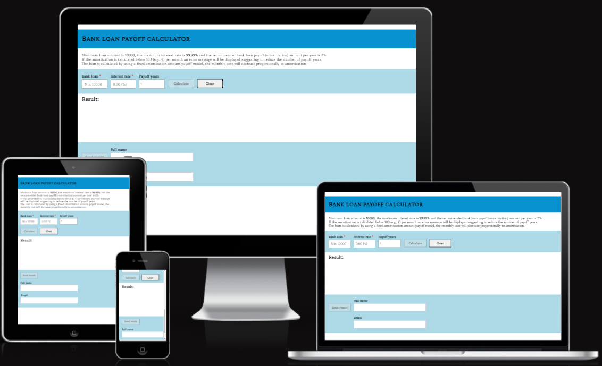
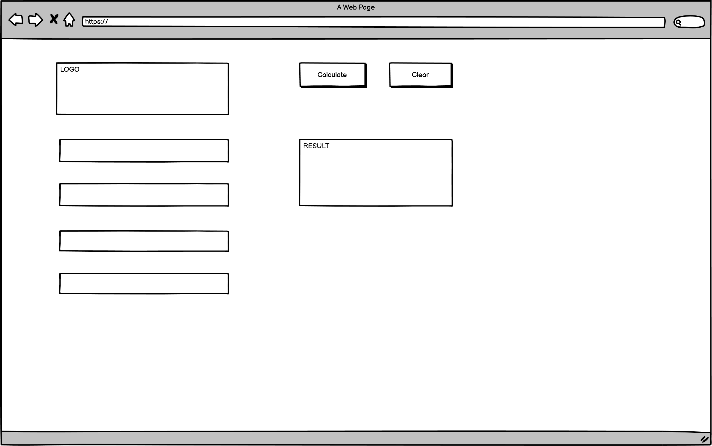
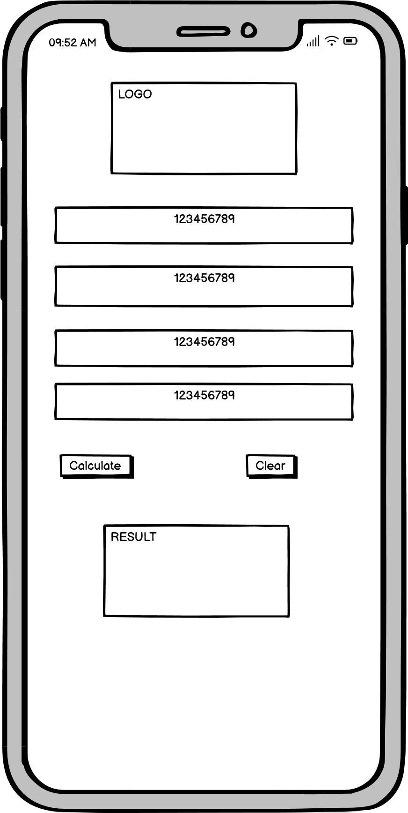
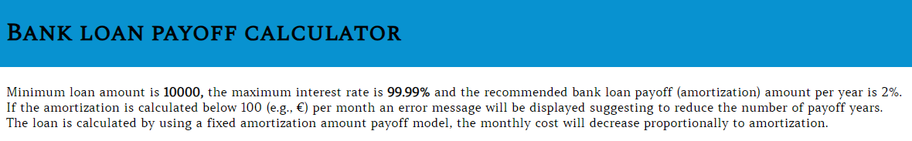
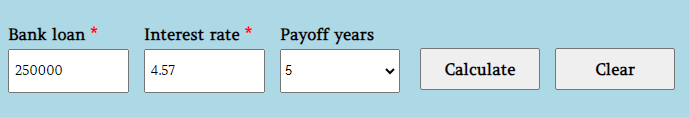
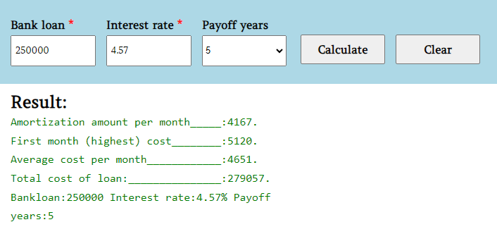
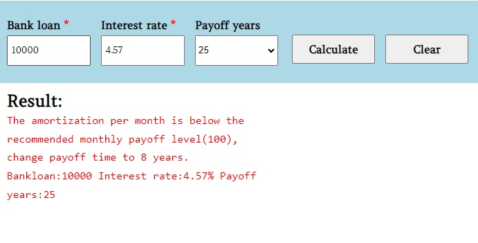
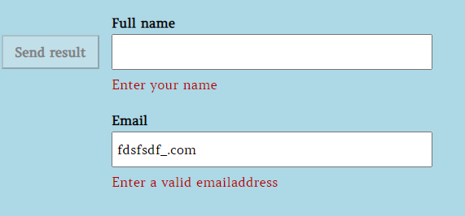
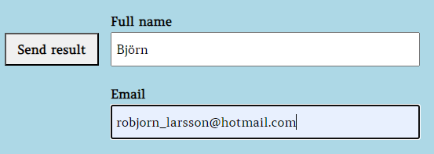
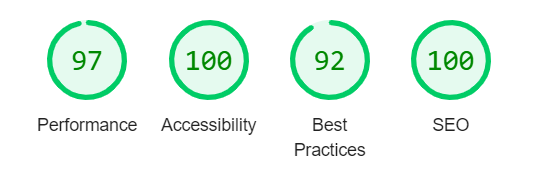

# BANK LOAN PAYOFF CALCULATOR

This site enables calculations of a payoff plan both on a monthly basis as well as displaying the total cost of the loan, by altering the input values on the page, different cost scenarios can be tested.

Link to the site:
[BANK LOAN PAYOFF CALCULATOR](https://bjornl1.github.io/bankloan-calculator/)

## CONTENTS

- [BANK LOAN PAYOFF CALCULATOR](#bank-loan-payoff-calculator)
  - [CONTENTS](#contents)
  - [User Experience (UX)](#user-experience-ux)
    - [User Stories](#user-stories)
  - [Design](#design)
    - [Colour Scheme](#colour-scheme)
    - [Typography](#typography)
    - [Wireframes](#wireframes)
  - [Features](#features)
    - [Future Implementations](#future-implementations)
    - [Accessibility](#accessibility)
  - [Technologies Used](#technologies-used)
    - [Languages Used](#languages-used)
    - [Frameworks, Libraries \& Programs Used](#frameworks-libraries--programs-used)
  - [Deployment \& Local Development](#deployment--local-development)
    - [Deployment](#deployment)
    - [Local Development](#local-development)
      - [How to Fork](#how-to-fork)
      - [How to Clone](#how-to-clone)
  - [Testing](#testing)
    - [Testing User Stories from (UX) Section](#testing-user-stories-from-ux-section)
      - [Validator Testing](#validator-testing)
      - [Further Testing](#further-testing)
  - [Credits](#credits)
    - [Code Used](#code-used)
    - [Content](#content)
    - [Acknowledgments](#acknowledgments)

---

## User Experience (UX)

- __Initiation of concept__
Bank loans can be a concern for many households world-wide, the expense can vary significantly depending on the interest rate, amortization and payoff time. Bank loan payoff calculator is a tool for letting anyone considering an investment requiring funds from a bank or financial institute perform an analysis of the financial impact.  
- __Key goals for the site__

  - To offer an easy to use bank loan calculator.
  - To offer a calculation tool that supports the user to balance the cost of a bank loan.

### User Stories

- __First time user:__
    I am:
  - Interested in the website's purpose and is eager to test the calculator.
  - Understanding how to alternate values for retrieving different results.

- __Returning User:__
    I am:  
  - Exploring the calculator function fully and trying with different scenarios to test the threshold levels when the result displays values below the recommended minimum payoff level.
  - Using the send result function and comparing various results.

## Design
### Colour Scheme
Since the page concerns financial aspects, the colours used are supposed to give a calm and serious impression for the user. At [Designerly](https://designerly.com/), the specific colour was found which is supposed to meet the above mentioned aspects. The header is a slightly darker blue whereas the calculation input and email fields are slightly lighter of the same suggesting that any input fields are identified with a consistent colour, the non-input fields are white. The colour scheme was created with [coolors](https://coolors.co/). 

### Typography        
The fonts chosen for the project are primarily Spectral SC and Amethysta with serif as backup, the fonts have a formal business approach intended to match the content and purpose of the site. When a calculation is performed, the numbers under the result label are displayed with Courier since this is the default font when using monospace. This was needed to improve and control the layout of that field (since it is an output field generated from javascript  there is not the same possibilities to style compared to regular text fields). Besides the font styles there is a colour variation on the output result depending on the input (green or red). A similar feature with colour styling is implemented on the emailfields (dark red), these functions are described more detailed in the feature chapter below. 
These fonts were imported with Google Fonts [Google Fonts](https://fonts.google.com/)

Spectral SC: Header (h1)
Amethysta: For all content except the result output text.
Courier (monospace): Result (output text from calculations).

### Wireframes

Desktop wireframe

Mobile wireframe

## Features

- The website is comprised of 4 sections: 
 - Header and information text field
   - Header
   - Information text field
 - Calculation field
   - Bank loan input
   - Interest input
   - Payoff years input
   - Calculate button
   - Clear button
 - Result field
   - Result output
 - Send result field
   - Send result button
   - Name field
   - Email id field

- Header and information text field
  -  The header at the top of the site is followed by a paragraph explaining the input requirements as well as the type of loan that is calculated and how the cost relates to amortization (payoff years).

- Calculation field
  - In this section, the user can test different levels of loan (time and amount). All input fields are restricted to only allow digits (in the interest rate a dot is allowed to handle decimals).
    - The bank loan field is set to an interval of 10000 - 999999999, if a lower value then 10000 is entered the calculate button will remain disabled while a maximum length of 9 characters is set to prevent writing an infinite value.
    - The interest rate field allows value up to 99.99 %, if left empty the calculate button will remain disabled so the user actively chooses a value rather than accidently performing an invalid calculation.
    - The payoff years field represents the number of years to pay off the loan, the interval is set to 1 - 50 in a dropdown menu.
    - The calculate button is linked to the function calculating the result, the result is presented in 2 different ways;
      - 1: The user has entered a value that is corresponding to the minimum requirement of "100" described in the info text in the first section. The values calculated are: amortization amount per month, first month (highest) cost, average cost per month and the total cost of loan. 
      - 2: The user has entered a value that is not matching the recommended input, in this scenario a message will be displayed to let the user reduce the payoff years to a level needed to meet the calculation requirements. The purpose of implementing this minimum requirement is to encourage a rational level of payment per month in relation to the sum of the loan, in the case of lending 10000 of 50 years the payment will be too low from this perspective.
    - The clear button can be used to clear all three input fields if requested, by using the clear function the calculate button will be set to disabled.
      
    

  - Result: This section presents the result of the calculation, if the result is according to minimum recommendations the result will be displayed in green to show that the calculation was performed with recommended input values.
    
    

If the calculation is done with values in payoff years leading to a payoff less than 100 per month a message will be displayed in red which indicates a "warning" to the user. The value needed to use in payoff years to perform a valid calculation will be presented to the user.

 

- Email send result field
If the user wishes to send the result, an email function is implemented, this section includes a send result button, name field and an email id field. 
  - The send result button is by default disabled to guide the user to fill the name and email first. Once both fields are filled correctly the button will be enabled.
  - If the full name field is left empty, an error message is presented under the name field, once the name is entered the message is removed.
  - The email field also displays an error if the email is not filled correctly e.g. missing "@".
    
  

- Once the name and email address is entered correctly the send result will be enabled according to the picture below.
  
  

### Future Implementations
  - Use "bars” for the input fields that the user can move either with the mouse pointer (laptop) or fingers (phone/tablet), the calculation results would be updated continuously once the bar is dragged across the screen.
  - Connect the page to a database to let users add either a valid currency that can be added after the amount, by using a database the currency will be updated continuously. Furthermore, this type of functionality could also be used to use ratios between different currencies (e.g. compare the loan in euro and dollars).

### Accessibility

- I have been mindful during coding to ensure that the website is as accessible and friendly as possible. I have achieved this by:
- Using semantic HTML.
- Added metadata characteristics for optimizing SEO.
- Use the "hover" function for buttons.

## Technologies Used

### Languages Used
- HTML5
- CSS
- JavaScript
### Frameworks, Libraries & Programs Used

- [Am I Responsive](https://ui.dev/amiresponsive) & [Responsinator](http://www.responsinator.com/) - To show the website image on a range of devices.

- [EmailJS](https://www.emailjs.com/) - Mail service to send mail directly from javascript code.

- [Balsamiq](https://balsamiq.com/) - Used to create wireframes.

- [Favicon.io](https://favicon.io/) To create favicon.
  
- Git - For version control.
  
- Github - To save and store the files for the website.

- [Google Dev Tools](https://developer.chrome.com/docs/devtools/) - To troubleshoot and test features, and solve issues with responsiveness and styling.

- [Google Fonts](https://fonts.google.com/) - To import the fonts used on the website.

  
## Deployment & Local Development

The project was deployed using GitHub pages. The steps to deploy using GitHub pages are:

Go to the repository on GitHub.com
Select 'Settings' near the top of the page.
Select 'Pages' from the menu bar on the left of the page.
Under 'Source' select the 'Branch' dropdown menu and select the main branch.
Once selected, click the 'Save'.
Deployment should be confirmed by a message on a green background saying "Your site is published at" followed by the web address.

### Deployment

Include instructions here on how to deploy your project. For your first project, you will most likely be using GitHub Pages.

### Local Development

#### How to Fork

- To fork the repository:

  - Log in (or sign up) to Github.
  - Go to the repository for this project,[bankloan-calculator](https://github.com/BjornL1/bankloan-calculator)
  - Click the Fork button in the top right corner.

#### How to Clone
- To clone the repository:

  - Log in (or sign up) to GitHub.
  - Go to the repository for this project,[bankloan-calculator](https://github.com/BjornL1/bankloan-calculator)
  - Click on the code button, select whether you would like to clone with HTTPS, SSH or GitHub CLI and copy the link shown.
  - Open the terminal in your code editor and change the current working directory to the location you want to use for the cloned directory.
  - Type 'git clone' into the terminal and then paste the link you copied in step 3. Press enter.

## Testing

### Testing User Stories from (UX) Section
-  As a user I am interested in the website's purpose and eager to test the calculator.
  - The site has a clean look with few distractions, the fields are labeled and placeholder text to facilitate a short lead time to start calculations. 

- As a user I am understanding how to alternate values for retrieving different results.
  - The clear button indicates the fields can be updated continuously and the drop down menu indicates that several calculations can be performed.

- Using the send result function and comparing various results.
  - By sending the result the user can save the result if needed and compare the result with updated calculations or send the result to others.

####  Validator Testing
W3C Markup Validator
  - HTML - No errors were returned when passing through the official W3C Markup Validator

- W3C Validator Results
  - CSS - No errors were found when passing through the official W3C CSS Validator

- JSHint
  - The test gives warning for: 'let' and 'const' is available in ES6 (use 'esversion: 6') or Mozilla JS extensions (use moz). After discussion with my mentor this is not a critical item and can be ignored, it is rather related to a default setting in JS hint and is connected to an extension in JSHint that is not detected/installed.
  - One undefined variable for EmailJS send mail function, however the code snippet is according to instructions and gives no error or strange behavior on any device/platform so this message from JShint is ignored.
    
- Lighthouse (desktop)
  - Accessibility/SEO
   - The site achieved a score of 100%, see below picture from lighthouse testing.
  - Performance achieved a score of 97%.
  - Best practice achieved a score of 92%, a generic message regarding ("Expect-CT` header is deprecated and will be removed. Chrome requires Certificate Transparency for all publicly trusted certificates issued after April 30, 2018") causing the lower score.
 
  

####  Further Testing

- Calculation field
  - The form has been tested to ensure it would not enable the calculation button if the bank loan is less than <10000 or the interest field is empty.
  - The clear button is working independently from input field values as intended, meaning it will clear the fields regardless of value.
    
- Result: output testing
  - The result is presented as intended, loans at the lower range and with too high value of payoff years are displayed with red if the minimum requirements (minimum 100 amortization per month) are not met, whereas values passing minimum requirements are displayed with green and costs presented. Re-calculation and new results can be generated without reloading the page. 

- Send result
The name and email field was tested individually, the error message is shown for the name field regardless of the status for the email field and vice versa. The send result button is only enabled once both fields are valid, and if any field is changed before sending the mail, the button is set to disabled again.

- Browser Testing
  - The Website was tested on Google Chrome, Firefox, Microsoft Edge, and Safari browsers with no issues noted, except the deviations described in "known bugs/compromise" section below. 

- Device Testing
  - The website was viewed on a variety of devices such as Laptop, iPhone 11, and iPad to ensure responsiveness on various screen sizes. The website performed as intended. The responsive design was also checked using Chrome developer tools across multiple devices with structural integrity holding for the various sizes.

I also used the following website to test responsiveness:
- Responsinator
- Am I responsive

- Solved bugs
  -  A problem with the input field on Iphone 11 was detected during the late stage of testing, the restriction of number, letters or other characters did not behave the same way as for the laptop version. Some re-coding was needed to have a consistent function between laptop and phone. Especially solving how to allow digits and a dot only but no other characters and also only allowing two decimal digits used in the text field for interest rate required a major investigation.

    
- Known Bugs/compromise
  - The difference between disabled and enabled buttons on a laptop is more clear than on a phone (Iphone), the styling on the buttons was adapted to suit both devices however still a compromise.
  - The result text is written with monospace to improve the layout, however on very large bank loans the total cost of loan is moved one row making it slightly offset from the other numbers presented in the output window, though in the absolute majority of results this is not the case.

 
## Credits
### Code Used 

- Specific coding
  - The payoff years dropdown menu for adding numbers is inspired by [stackoverflow](https://stackoverflow.com/questions/43231860/how-to-create-options-from-1-to-100-in-selection-list-by-using-javascript). The code can be found by searching on "addOptions();".
  - Error message for showing name and email error not valid is inspired by [GreatStack](https://www.youtube.com/watch?v=ndNPg8-5jgI) but with added functionality to handle both name and email id field, the tutorial only explains a mail id field. The code can be found by searching on "function validateEmail();".
  - The email function service code is according to the instruction from [EmailJS](https://www.emailjs.com/). The code can be found by searching on "function SendMail()".

 - General coding
   - For inspiration and tips the major sources were:
   - [W3 Schools](https://www.w3schools.com)
   - [Mozilla](https://developer.mozilla.org/en-US/docs/Learn)
 
  
### Content

The idea is my own and also the basis for which content should be included, though with advice from my mentor the email function was added during the project development phase and a field controlling amortization was removed.

### Acknowledgments

- I would like to thank the following:
  - Antonio Rodriguez (mentor) for guidance and support. 
  - Slack community - for quick feedback on various questions
  - My family - for their patience with having me coding sometimes late evenings and nights.  
